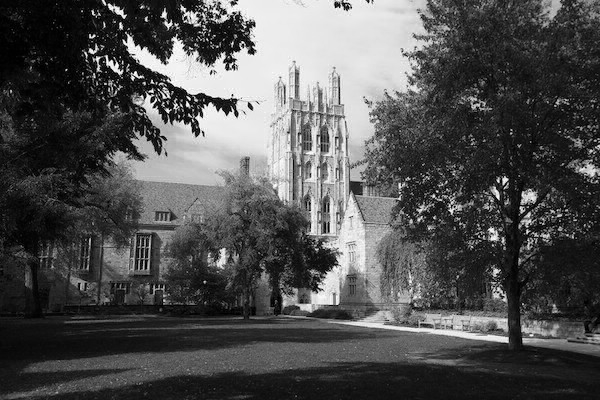

# filter-more
This is the CS50 filter-more problem set 4.

## Goals
The goal of this project is to use the command line interface to produce various filtered images, depending on a flag, using C language.

## Features
This project has 5 flags (filters) that can be applied to .bmp images format. Four of wich CS50 filter-more asked me to do (grayscale, reflection, blur, edges) and one that I did by looking at the CS50 filter-less (sepia):

- Grayscale: This aplies a pure Black and White filter to the chosen image.
- Reflection: This aplies a Reflection filter to the image, so it mirrors all the pixels horizontally.
- Blur: This aplies the "box blur" algorithm to the image, so it mimics a Gaussian Blur.
- Edges: This is a filter that detect edges in the image and highlights it by changing the color of the pixels on the edge and around it. This filter uses the Sobel Operator algorithm to detect edges.
- Sepia: This aplies the sepia filter to the image. In other words, it gives the image an old feel.

## What I did
I was responsable only for implemment the functions in the `helpers.c` file. The other files, CS50 gave me as distribution code, but I made sure to completely understand what was going on in the whole project and how `filter.c` works. I also implemented, completely by my own, the sepia filter that I saw in filter-less and did the correspondent changes for it to work.

In this problem set (a.k.a. pset) CS50 gave me instructions on how to build each one of the filters I've implemented. They also gave me four distribution codes that were used in this pset that I changed in order to acomplish the sepia filter:

- `bmp.h`: This is a library that implements a whole set of `structs` and `tydefs` that are used in `filter.c` (another distribution code) so it becomes easier to handle bmp files.
- `herlpers.h`: This is just a file that contains the prototypes of the functions I've implemented.
- `Makefile`: This tells the computer how to compile the files that form the whole pset. It also can be used by copying and pasting the content in the terminal window.
- `filter.c`: This is the main code of the whole project. It is used to allow flags when running the program, to transform the bmp image into an array of pixels that I used in the `helpers.c`, calls the correct functions in `helpers.c` and, finally, writes the content that was in the array into the file, effectively aplying the filter.
- `helpers.c`: This was, effectively the code that I myself wrote. It contains the functions that apply the filters to the images.

## Usage of the filter.c
As I said before, it's possible to use five flags to run the program:

- `-b`: Blur -> aplies the blur filter to the image.
- `-e`: Edges -> aplies the edges filter to the image.
- `-g`: Grayscale -> aplies the grayscale filter to the image.
- `-r`: Reflection -> aplies the reflection filter to the image.
- `-s`: Sepia -> aplies the sepia filter to the image.

### Usage

> `./filter -<flag> images/infile.bmp images/outfile.bmp`

## Notes
In this repository you'll find five directories:

- blur-images
- edge-images
- grayscale-images
- reflect-images
- sepia-images

As their name suggest, they have inside the images with the corresponding filters as a sample of how the effects look like.

Here are some examples

### Original image

### Example of a blurred image

### Example of an edged image

### Example of a grayscaled image

### Example of a reflected image

### Example of a sepia image

If you wish to see all the examples, please click on the images folder and select the directory or image you wold like to see and than click on \"view raw".

I hope you enjoyed the project as much as I did.